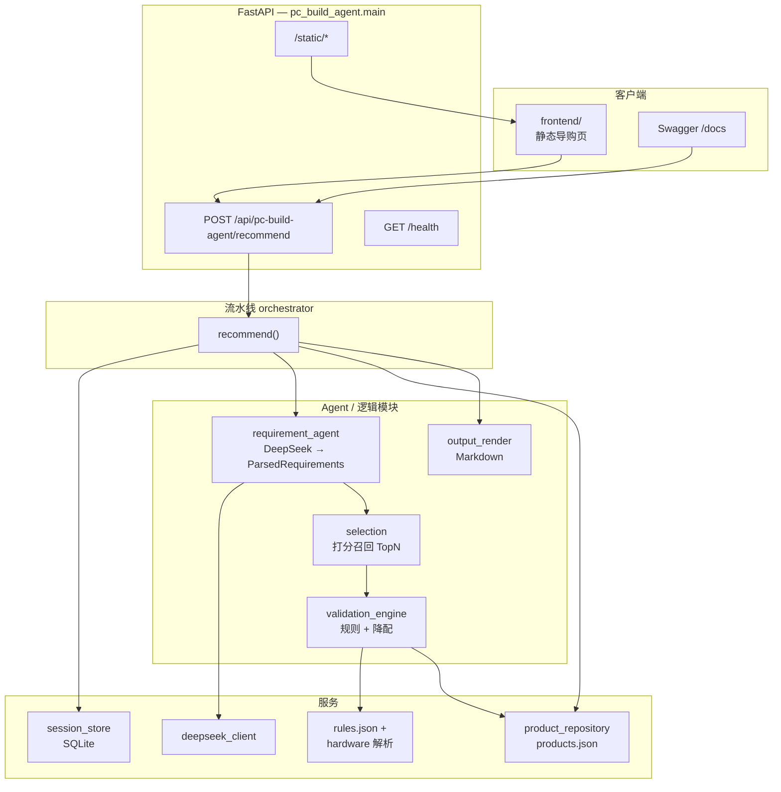
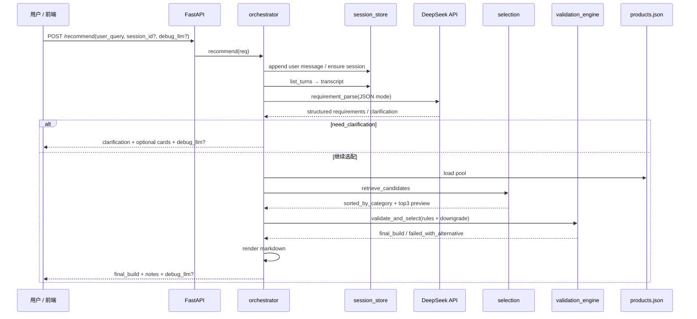

# 京东装机导购 Agent（PC_guide）

面向装机场景的 **自然语言导购**：解析预算与偏好 → 从 Mock 商品池召回候选 → **代码层做兼容性 / 功耗 / 预算校验与降配** → 输出清单与京东链接占位。**可选 DeepSeek** 完成需求结构化理解。

---

## 功能概览

| 能力 | 说明 |
|---|---|
| 需求理解 | 调用 DeepSeek Chat Completions（JSON），抽取预算、用途、显示器、指定配件、权重等 |
| 追问（V1） | 至多一轮追问；支持结构化追问卡片字段 `clarification_cards`，前端卡片勾选回填 |
| 召回 | 按品类打分排序（权重模拟装机取舍），每品类 Top3 预览 |
| 校验 | **确定性规则**：CPU–主板、DDR、电源瓦数、360 冷排与机箱等；超预算策略触发降配 |
| 会话 | SQLite 持久化多轮对话，请求携带 `session_id` 拼接上下文 |
| 前端 | 京东红白风格的静态导购页 + Swagger `/docs` |
| 调试 | `debug_llm` / `PC_GUIDE_DEBUG_LLM` 返回模型请求与响应轨迹（含 `reasoning_content` 若上游返回） |

---

## 系统架构

下图描述「单次推荐请求」在系统中的分层关系（前端可与后端同源部署，也可仅为示例）。



---

## 技术流程（推荐链路）

从用户输入到响应数据的端到端步骤：



**关键点**

1. **LLM 只承担「需求理解」**：结构化约束与权重；不替代兼容性终审。  
2. **校验与预算**：由 `validation_engine` + `rules.json` + 名称解析完成；超过预算上限一定比例会触发循环降配，禁止直接输出「严重超标」作为最终方案。  
3. **品类**：内部统一中文品类（处理器、显卡、主板……），Mock 数据见 `pc_build_agent/data/products.json`。

---

## 目录结构

```
PC_guide/
├── README.md                          # 本文件
├── requirements.txt
├── .env.example                       # 环境变量示例（勿提交真实 .env）
├── frontend/                          # 京东风格导购前端（同源挂载）
│   ├── index.html
│   ├── app.js
│   └── styles.css
├── scripts/
│   └── generate_mock_products.py      # 生成 Mock 商品 JSON（每类约 20 条）
├── pc_build_agent/
│   ├── main.py                        # FastAPI 入口，挂载静态资源
│   ├── config.py                      # pydantic-settings 读取环境变量
│   ├── models/schemas.py              # 请求/响应 Pydantic 模型
│   ├── pipeline/orchestrator.py       # 推荐编排与 debug_llm 组装
│   ├── agents/
│   │   ├── requirement_agent.py       # DeepSeek 需求解析 prompt
│   │   ├── selection.py               # 打分召回
│   │   ├── validation_engine.py      # 兼容 / 功耗 / 预算降配
│   │   ├── hardware.py                # 名称解析辅助
│   │   └── output_render.py           # Markdown 输出
│   ├── services/
│   │   ├── deepseek_client.py        # OpenAI 兼容 /v1/chat/completions
│   │   ├── session_store.py          # SQLite 会话
│   │   └── product_repository.py     # 加载 JSON 商品池
│   └── data/
│       ├── products.json             # Mock 商品池（可替换为爬取结果）
│       └── rules.json                # 规则库（CPU–主板、功耗等）
├── data/                              # 运行时 SQLite 默认目录（见配置）
│   └── pc_guide_sessions.sqlite       # 本地生成，默认不入库见 .gitignore
├── 京东装机导购agent研发设计文档.md
└── 京东装机商品数据爬取需求文档.md
```

---

## 技术栈

| 层级 | 选型 |
|---|---|
| 运行时 | Python 3.10+（建议） |
| Web | FastAPI、Uvicorn |
| HTTP 客户端 | httpx |
| 配置 | pydantic-settings、python-dotenv |
| LLM | DeepSeek（OpenAI 兼容 API，`response_format: json_object`） |
| 持久化 | sqlite3（会话消息） |
| 前端 | 原生 HTML/CSS/JS，Marked CDN（Markdown 渲染） |

---

## 快速开始

### 1. 克隆与虚拟环境

```bash
git clone https://github.com/fldy2639/PC_guide.git
cd PC_guide
python -m venv .venv
# Windows
.venv\Scripts\activate
# Linux / macOS
source .venv/bin/activate

pip install -r requirements.txt
```

### 2. 环境变量

复制 `.env.example` 为 `.env`，填写 **`DEEPSEEK_API_KEY`**。可选：`DEEPSEEK_MODEL`、`PC_GUIDE_DEBUG_LLM=true` 等。

### 3. Mock 商品数据（可选）

仓库已自带 `pc_build_agent/data/products.json`。若需重新生成：

```bash
python scripts/generate_mock_products.py
```

### 4. 启动服务

在项目根目录 `PC_guide` 下执行：

```bash
python -m uvicorn pc_build_agent.main:app --host 127.0.0.1 --port 8000
```

| URL | 说明 |
|---|---|
| `http://127.0.0.1:8000/` | 导购前端 |
| `http://127.0.0.1:8000/docs` | Swagger API |
| `http://127.0.0.1:8000/health` | 健康检查 |

---

## 配置说明（环境变量）

| 变量 | 含义 | 默认 |
|---|---|---|
| `DEEPSEEK_API_KEY` | DeepSeek 密钥 | 空（必填否则解析报错） |
| `DEEPSEEK_BASE_URL` | API 基址 | `https://api.deepseek.com` |
| `DEEPSEEK_MODEL` | 模型名 | `deepseek-chat` |
| `PC_GUIDE_DB_PATH` | 会话 SQLite 路径 | `./data/pc_guide_sessions.sqlite` |
| `PC_GUIDE_PRODUCTS_PATH` | 商品 JSON | `./pc_build_agent/data/products.json` |
| `PC_GUIDE_RULES_PATH` | 规则 JSON | `./pc_build_agent/data/rules.json` |
| `PC_GUIDE_DEBUG_LLM` | 是否在响应中带调试轨迹 | `false` |

---

## API 摘要

### `POST /api/pc-build-agent/recommend`

**Request（节选）**

```json
{
  "user_query": "我想配一台 6000-8000 元主机玩 3A，不要显示器。",
  "session_id": null,
  "version": "v1",
  "debug_llm": false
}
```

**Response（节选）**

- `data.need_clarification === true`：追问文案、`clarification_cards`、`session_id`。  
- 否则：`final_build`、`total_price`、`budget_check`、`risk_check`、`candidates_preview`（Top3）、`recommendation_markdown` 等。  
- `data.debug_llm`：调试开启时出现（步骤内含 `request.messages` 与 `assistant_message.reasoning_content` 字段占位）。

---

## 前端 behavior

- 勾选「调试」会向接口传 `debug_llm: true`（仍可配合服务端 `PC_GUIDE_DEBUG_LLM`）。  
- 追问时在左侧展示可选卡片；`session_id` 存于 `sessionStorage`，多轮自动接续。

---

## 后续接入真实数据

参见 **`京东装机商品数据爬取需求文档.md`**：合规边界、字段与 V2 扩展对齐、更新频率与验收口径。将离线生成的标准化 JSON **替换或映射到** `PC_GUIDE_PRODUCTS_PATH` 指向的文件格式即可渐进接入（需同步品类枚举与校验字段）。

---

## 免责声明

- 本项目为 **技术演示与学习**：前端红白配色仅为风格参考，**非京东官方产品**。  
- Mock 价格与链接为占位；导购结论不构成购物承诺，以下单品详情页为准。  
- 使用爬虫获取站点数据前须完成平台协议与法务评审；优先考虑京东开放平台等合法数据源。

---

## 许可

若未另行约定，代码仓库默认遵循仓库根目录许可证声明（如无 LICENSE 文件，使用前请自行补充）。
